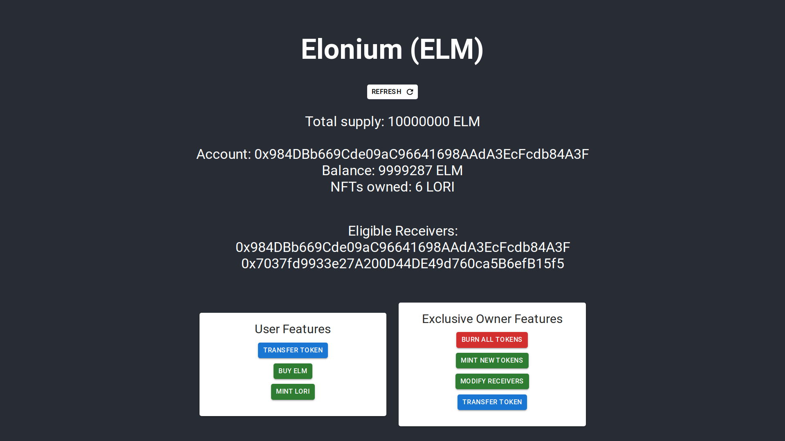

# Elonium



An ERC 20 token deployed on the Celo `alfajores` testnet using `hardhat`, `solidity` & `web3`/`contractkit`. This repository contains the frontend built with `react` & `mui` using `contractkit` to interact with the smart contract on the blockchain.


### ~ Owner Features ~

- [X] Owner can burn all tokens
- [X] Owner can mint an arbitrary number of tokens
  - Tokens will be transferred to owner's account
- [X] Owner can modify list of eligible receivers
  - Add/remove addresses from the list
  - Adding an address that exist or removing one that doesn't will result in a failed transaction
- [X] Owner can transfer an arbitrary amount of tokens between any two addresses
  - The receiver needs to be in the receiver list
  - The account must hold that amount of tokens
  
- [X] Mining of ELM tokens in Proof of Work process
- [X] Mining of ELM tokens in Proof of Stake process
  

### ~ User Features ~

- [X] Users can transfer a number of tokens to any receivers (within the list)
- [X] Users can buy ELM tokens using CELO
  - This operation is performed by sending CELO without any data to the contract address
  - Useless operation if performed by the owner 
- [X] Users can mint an NFT (LORI) with ELM tokens
  - No input is required here
  - Each transaction creates a single NFT
  - The LORI contract address is to be present in the eligible receivers list (handled automatically if not)


### ~ Some useful commands ~

```bash
# Setup environment
npm install 

# Start react development server
npm start
```

### ~ Notes ~

- `.env` contains the following variables
  - `REACT_APP_PRIVATE_KEY` - private key of the user account, used for testing (could incorporate `metamask` in the future)
  - `REACT_APP_CELO_NODE`="https://alfajores-forno.celo-testnet.org"
  - `REACT_APP_ELM_CONTRACT_ADDRESS` - address of contract deployed on `alfajores`, obtained after hardhat deployment
  - `REACT_APP_LORI_CONTRACT_ADDRESS` - address of contract deployed on `alfajores`, obtained after hardhat deployment
- The top section contains basic (read only) information of the contract and account
  - Hitting refresh only fetched the top section
- Feedback are usually provided by a popup dialog which contains the information of the transaction block
- Check `console.log` to debug transaction errors or anything really
